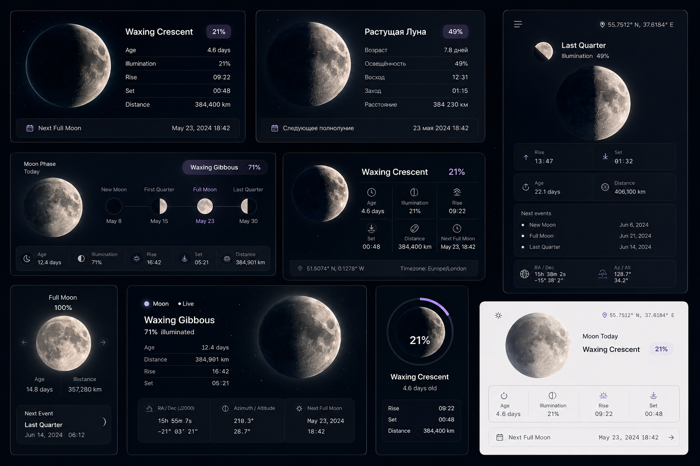

<a id="top"></a>

<!-- PROJECT TITLE -->
Moon Widget is a lightweight, fully typed React component that renders a real-time Moon phase widget - current phase, illumination, moonrise/moonset, RA/Dec and Az/Alt coordinates, and upcoming phase dates - for any date and geographic location, with a procedurally shaded PIXI.js-rendered Moon disc.
You can use this repository to drop a beautiful Moon widget into your own site - and if you like it, please give the project a star :)

<div align="center">
  

<h3>Moon Widget</h3>

<a href="https://github.com/miksrv/moon-widget/tree/main/apps/site" target="_blank">Demo Site Source</a>
·
<a href="https://github.com/miksrv/moon-widget/issues/new?labels=bug&title=%5BBug%5D%3A+">Report Bug</a>
·
<a href="https://github.com/miksrv/moon-widget/issues/new?labels=enhancement&title=%5BFeature%5D%3A+">Request Feature</a>
·
<a href="#contact">Contact</a>
</div>

<br />

<!-- PROJECT BADGES -->
<div align="center">

[![Contributors][contributors-badge]][contributors-url]
[![Forks][forks-badge]][forks-url]
[![Stargazers][stars-badge]][stars-url]
[![Issues][issues-badge]][issues-url]
[![MIT License][license-badge]][license-url]

[![npm version][npm-version-badge]][npm-url]
[![npm downloads][npm-downloads-badge]][npm-url]
[](https://github.com/miksrv/moon-widget/actions/workflows/checks.yml)
[](https://github.com/miksrv/moon-widget/actions/workflows/release.yml)
[](https://sonarcloud.io/summary/new_code?id=miksrv_moon-widget)
[](https://sonarcloud.io/summary/new_code?id=miksrv_moon-widget)

</div>

---

<!-- TABLE OF CONTENTS -->
### Table of Contents

- [About the Project](#about-the-project)
    - [Key Features](#key-features)
    - [Variants](#variants)
    - [Built With](#built-with)
- [Repository Structure](#repository-structure)
- [Installation](#installation)
- [Usage](#usage)
    - [Props](#props)
- [Screenshots and Demos](#screenshots-and-demos)
- [Contributing](#contributing)
- [License](#license)
- [Contact](#contact)

## Documentation

Detailed architecture and workflow notes live in [`CLAUDE.md`](./CLAUDE.md) - the dev-from-source/build-from-npm
switch, the moon-rendering internals, styling conventions, and full command reference for both projects in this
monorepo.

<!-- ABOUT THE PROJECT -->
## About the Project

Moon Widget computes real Moon data - phase, age, illumination, rise/set times, distance, equatorial and horizontal
coordinates, and the next upcoming phase dates - from a latitude, longitude and date using
[`suncalc`](https://github.com/mourner/suncalc), then renders it through one of eight presentational layouts. The
Moon disc itself is a single texture rendered with [pixi.js](https://pixijs.com/), with the day/night terminator
shadow drawn procedurally with two arc masks rather than swapped from pre-rendered images.


### Key Features

- **Phase & age** - current phase name and age in days, computed for any date.
- **Illumination %** - accurate illuminated fraction of the visible disc.
- **Rise & set times** - moonrise and moonset for your latitude, longitude and timezone.
- **Distance** - current distance to the Moon in kilometers.
- **Coordinates** - equatorial (RA/Dec) and horizontal (Az/Alt) coordinates in real time.
- **Upcoming events** - dates for the next new, full and quarter moons.
- **Localization** - built-in English and Russian locales, easy to extend.
- **Theming** - `dark`/`light` themes out of the box, fully customizable via CSS custom properties.
- **Live mode** - omit `date` and the widget ticks every second instead of rendering a static moment.
- **Zero-config styling** - plain CSS, no CSS Modules/Sass, works with any consumer bundler.

<p align="right">
  (<a href="#top">Back to top</a>)
</p>

### Variants

`MoonWidget` is a thin dispatcher over eight presentational components - pick the one that fits your layout via the
`variant` prop:

| Variant     | Description                                                                          |
| ----------- | ------------------------------------------------------------------------------------- |
| `compact`   | Compact horizontal card - disc, phase name and core stats. Good for headers/sidebars. |
| `panel`     | Rich panel with a mini-header disc, RA/Dec, Az/Alt and a list of upcoming events.      |
| `timeline`  | Phase name/percentage banner plus a New/First/Full/Last quarter timeline.              |
| `grid`      | Icon-grid layout listing every stat with its own icon.                                |
| `detail`    | Centered disc card with a self-contained prev/next-day carousel.                      |
| `live`      | Centered disc with a pulsing "Live" indicator when no fixed `date` is given.           |
| `gauge`     | Circular illumination progress ring around the phase name.                            |
| `card`      | Light-themed summary card in the style of a weather widget.                           |

<p align="right">
  (<a href="#top">Back to top</a>)
</p>

### Built With

- [![TypeScript][ts-badge]][ts-url] Fully typed component, props and hooks.
- [![React][react-badge]][react-url] UI layer; `react`/`react-dom` (>=17) are peer dependencies.
- [![NextJS][nextjs-badge]][nextjs-url] Powers the static-export demo/landing site in `apps/site`.
- [![NodeJS][nodejs-badge]][nodejs-url] Runtime for tooling and package management.
- pixi.js - WebGL rendering of the Moon disc and the procedural terminator shadow.
- suncalc - Moon illumination, position and rise/set astronomical calculations.
- dayjs - locale-aware calendar date formatting.
- [![GitHub Actions][githubactions-badge]][githubactions-url] Lint/test/build checks, changesets-based npm release, and FTP deploy of the static site.
- [![SonarCloud][sonarcloud-badge]][sonarcloud-url] Code quality and coverage analysis.

<p align="right">
  (<a href="#top">Back to top</a>)
</p>

<!-- REPOSITORY STRUCTURE -->
## Repository Structure

This repository holds **two deliberately independent Yarn projects**, not a single workspaces tree:

- [`packages/moon-widget`](packages/moon-widget) - the published npm package (`moon-widget`). See its own
  [README](packages/moon-widget/README.md) for the package-level install/usage reference.
- [`apps/site`](apps/site) - a Next.js (App Router) landing/demo site, deployed as a static export via FTP. It
  depends on `moon-widget` as an ordinary npm dependency (never `workspace:`), so its production build always
  exercises exactly what real consumers of the npm package get. In development it's aliased to
  `packages/moon-widget/src` instead, so changes to the widget's source are visible immediately - see
  [`CLAUDE.md`](./CLAUDE.md) for why and how.

Only `packages/*` is a Yarn workspace member at the repo root; `apps/site` has its own `.yarnrc.yml` + `yarn.lock`
and must be installed separately.

<!-- INSTALLATION -->
## Installation

### Prerequisites

- **Node.js** 20+
- **Yarn Berry** (v4.6.0, via Corepack)

### 1. Clone the repository

```bash
git clone https://github.com/miksrv/moon-widget.git
cd moon-widget
```

### 2. Widget (from the repo root)

```bash
yarn install                          # installs the workspaces root (packages/moon-widget only)
yarn build                            # tsup -> dist: esm + cjs + dts + css
yarn test                             # jest
yarn test:coverage
yarn eslint:check / yarn eslint:fix
yarn prettier:check / yarn prettier:fix
```

To run a single test file: `yarn workspace moon-widget jest src/MoonWidget.test.tsx`.

### 3. Demo Site (a separate Yarn project - not reachable from the root)

```bash
cd apps/site
yarn install
yarn dev      # next dev --webpack, widget resolved from packages/moon-widget/src (live source)
yarn build    # next build --> apps/site/out/, widget resolved from the real installed npm package
yarn lint
```

<p align="right">
  (<a href="#top">Back to top</a>)
</p>

<!-- USAGE -->
## Usage

```bash
yarn add moon-widget
# or
npm install moon-widget
```

`react` and `react-dom` (>=17) are peer dependencies. The stylesheet is a separate import so consumers control when
and how it's loaded:

```tsx
import { MoonWidget } from 'moon-widget'
import 'moon-widget/style.css'

function App() {
    return (
        <MoonWidget
            lat={51.76712}
            lon={55.09785}
            timezone="Asia/Yekaterinburg"
            language="en"
            variant="panel"
            theme="dark"
        />
    )
}
```

Omit `date` for a live clock that recomputes every second; pass an ISO date/time string to render a fixed moment
instead.

### Props

| Prop       | Type                                                                                    | Default      | Description                                                                    |
| ---------- | ---------------------------------------------------------------------------------------- | ------------ | ------------------------------------------------------------------------------- |
| `lat`      | `number`                                                                                  | -            | Latitude of the observer.                                                       |
| `lon`      | `number`                                                                                  | -            | Longitude of the observer.                                                      |
| `date`     | `string`                                                                                  | current time | ISO date/time to render. When omitted, the widget ticks live (every second).    |
| `timezone` | `string`                                                                                  | `'UTC'`      | IANA timezone name used to format rise/set times, e.g. `'Asia/Yekaterinburg'`.   |
| `language` | `'en' \| 'ru'`                                                                            | `'en'`       | UI label language.                                                              |
| `variant`  | `'compact' \| 'panel' \| 'timeline' \| 'grid' \| 'detail' \| 'live' \| 'gauge' \| 'card'` | `'compact'`  | Which of the eight presentational layouts to render (see [Variants](#variants)). |
| `theme`    | `'dark' \| 'light'`                                                                       | `'dark'`     | Color theme; orthogonal to `variant` - any layout runs in either theme.          |

<p align="right">
  (<a href="#top">Back to top</a>)
</p>

<!-- SCREENSHOTS -->
## Screenshots and Demos

All eight variants, in both dark and light themes and both English and Russian locales, in a single reference sheet:


<p align="right">
  (<a href="#top">Back to top</a>)
</p>

<!-- CONTRIBUTING -->
## Contributing

Contributions are what make the open-source community an incredible environment for learning, inspiration, and
innovation. Your contributions are highly valued and greatly appreciated, whether it's reporting bugs, suggesting
improvements, or creating new features.

**To contribute:**

1. Fork the project by clicking the "Fork" button at the top of this page.
2. Clone your fork locally:
   ```bash
   git clone https://github.com/miksrv/moon-widget.git
   ```
3. Create a new feature branch:
   ```bash
   git checkout -b feature/AmazingFeature
   ```
4. Make your changes, then commit them:
   ```bash
   git commit -m "Add AmazingFeature"
   ```
5. Push your changes to your forked repository:
   ```bash
   git push origin feature/AmazingFeature
   ```
6. Open a pull request from your feature branch to the main repository.

New UI strings must be added to both `en` and `ru` locales in `src/translations.ts`. Run
`yarn changeset` to record a changeset for the next release before opening a PR against `packages/moon-widget`.

<p align="right">
  (<a href="#top">Back to top</a>)
</p>

## License

<!-- LICENSE -->
Distributed under the MIT License. See [LICENSE](LICENSE) for more information.

<p align="right">
  (<a href="#top">Back to top</a>)
</p>

## Contact

Misha Topchilo - [github.com/miksrv](https://github.com/miksrv)

<p align="right">
  (<a href="#top">Back to top</a>)
</p>

<!-- MARKDOWN VARIABLES (LINKS, IMAGES) -->
[contributors-badge]: https://img.shields.io/github/contributors/miksrv/moon-widget.svg?style=for-the-badge
[contributors-url]: https://github.com/miksrv/moon-widget/graphs/contributors
[forks-badge]: https://img.shields.io/github/forks/miksrv/moon-widget.svg?style=for-the-badge
[forks-url]: https://github.com/miksrv/moon-widget/network/members
[stars-badge]: https://img.shields.io/github/stars/miksrv/moon-widget.svg?style=for-the-badge
[stars-url]: https://github.com/miksrv/moon-widget/stargazers
[issues-badge]: https://img.shields.io/github/issues/miksrv/moon-widget.svg?style=for-the-badge
[issues-url]: https://github.com/miksrv/moon-widget/issues
[license-badge]: https://img.shields.io/github/license/miksrv/moon-widget.svg?style=for-the-badge
[license-url]: https://github.com/miksrv/moon-widget/blob/main/LICENSE

<!-- Other ready-made icons can be seen for example here: https://github.com/inttter/md-badges -->
[npm-version-badge]: https://img.shields.io/npm/v/moon-widget?logo=npm&label=npm
[npm-downloads-badge]: https://img.shields.io/npm/dm/moon-widget?logo=npm&label=downloads
[npm-url]: https://www.npmjs.com/package/moon-widget
[ts-badge]: https://img.shields.io/badge/TypeScript-3178C6?logo=typescript&logoColor=fff
[ts-url]: https://www.typescriptlang.org/
[react-badge]: https://img.shields.io/badge/React-black?logo=react&logoColor=61DAFB
[react-url]: https://react.dev/
[nextjs-badge]: https://img.shields.io/badge/Next.js-black?logo=next.js&logoColor=white
[nextjs-url]: https://nextjs.org/
[nodejs-badge]: https://img.shields.io/badge/Node.js-6DA55F?logo=node.js&logoColor=white
[nodejs-url]: https://nodejs.org/
[sonarcloud-badge]: https://img.shields.io/badge/SonarCloud-F3702A?logo=sonarcloud&logoColor=fff
[sonarcloud-url]: https://sonarcloud.io/
[githubactions-badge]: https://img.shields.io/badge/GitHub_Actions-2088FF?logo=github-actions&logoColor=white
[githubactions-url]: https://docs.github.com/en/actions
